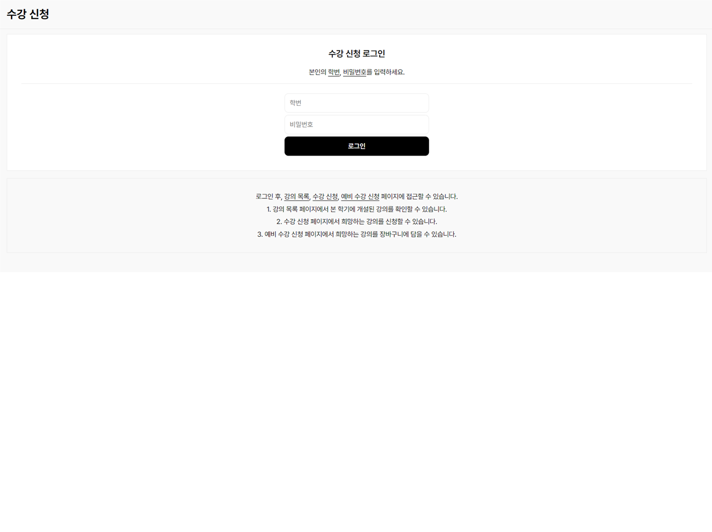
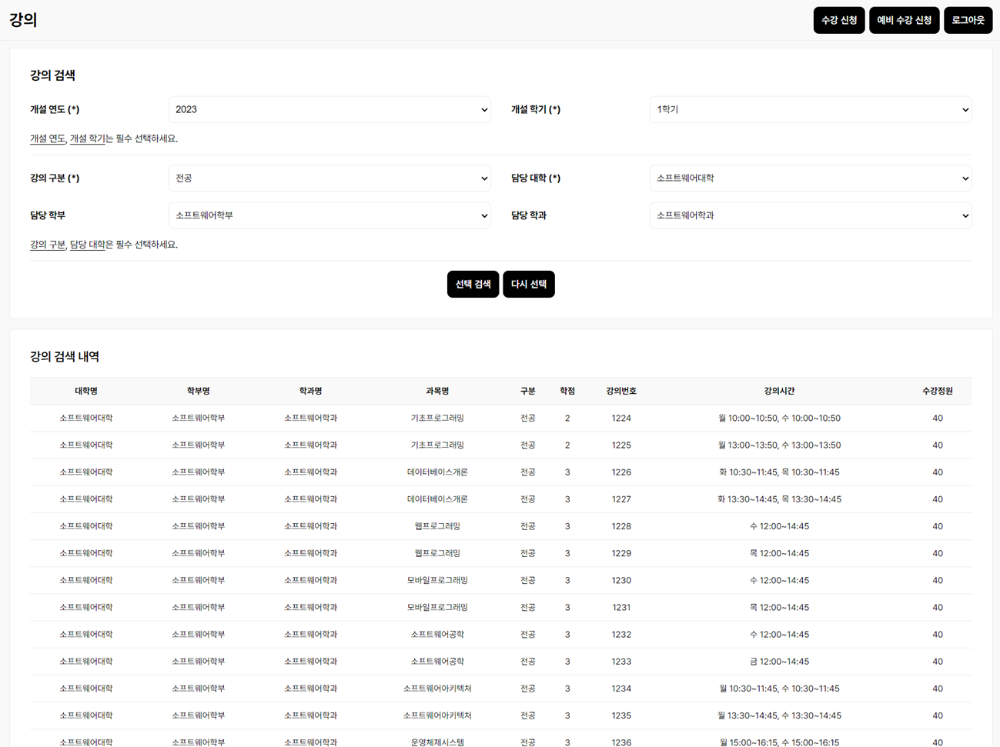
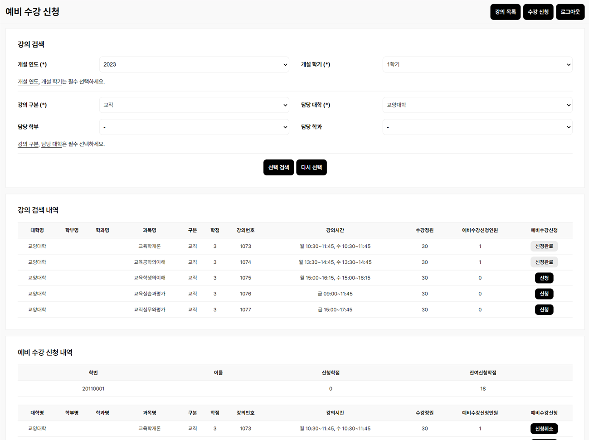
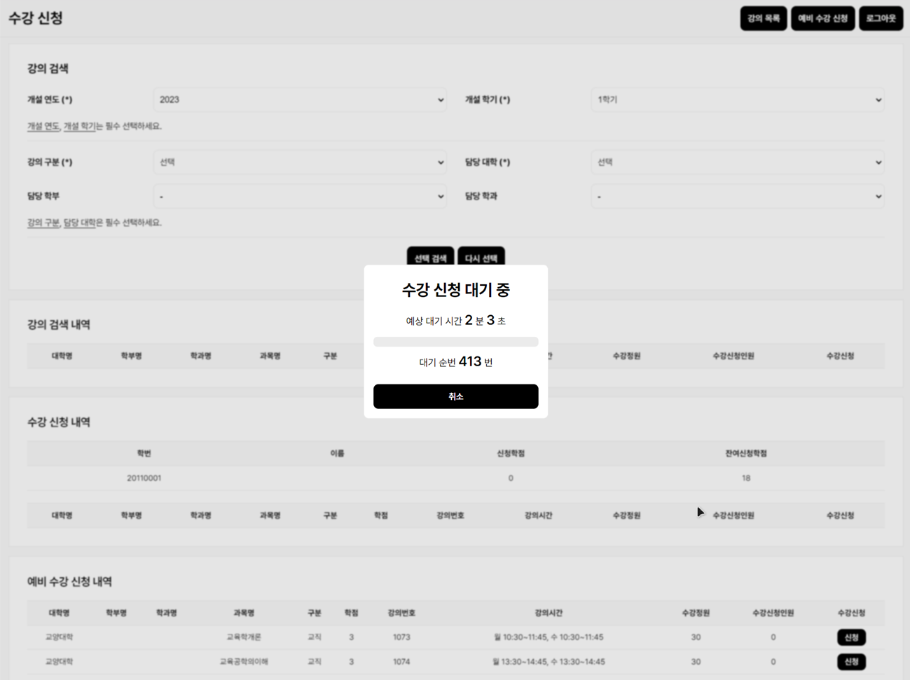
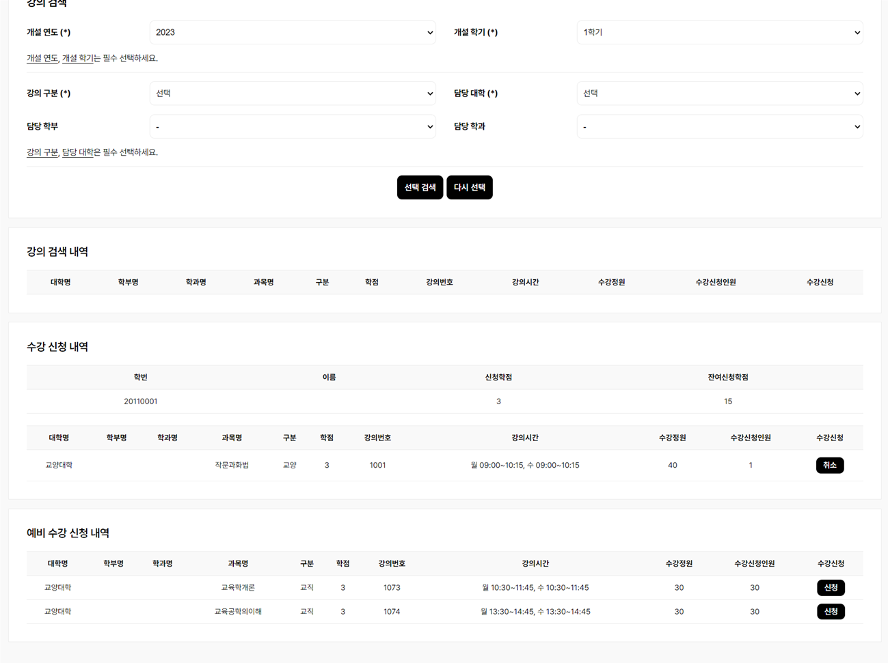
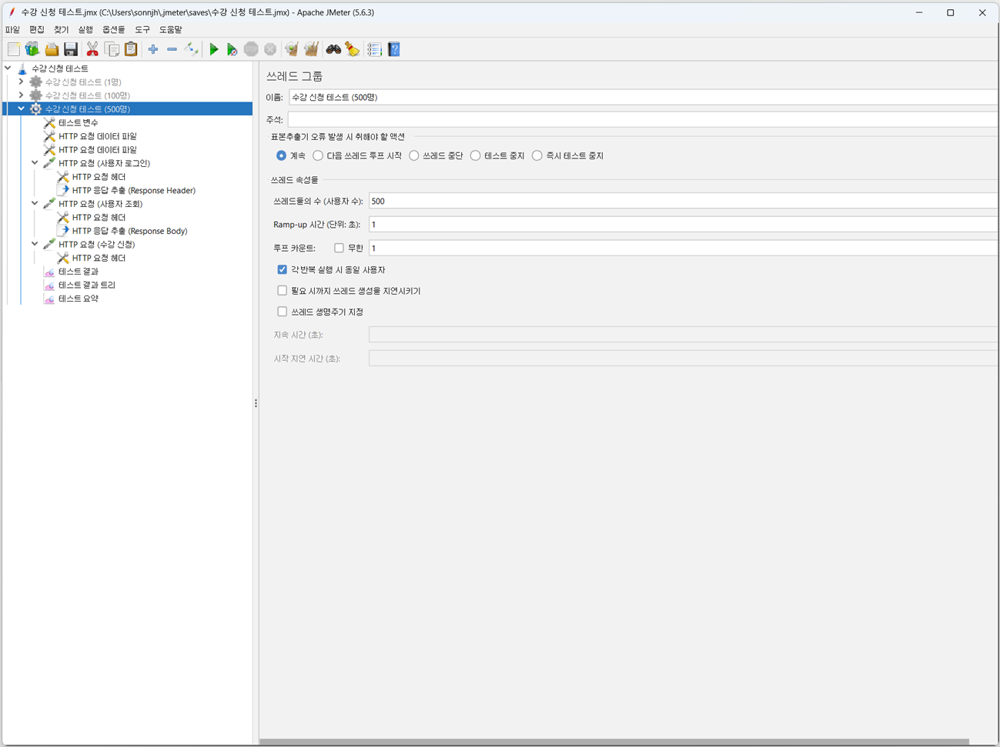
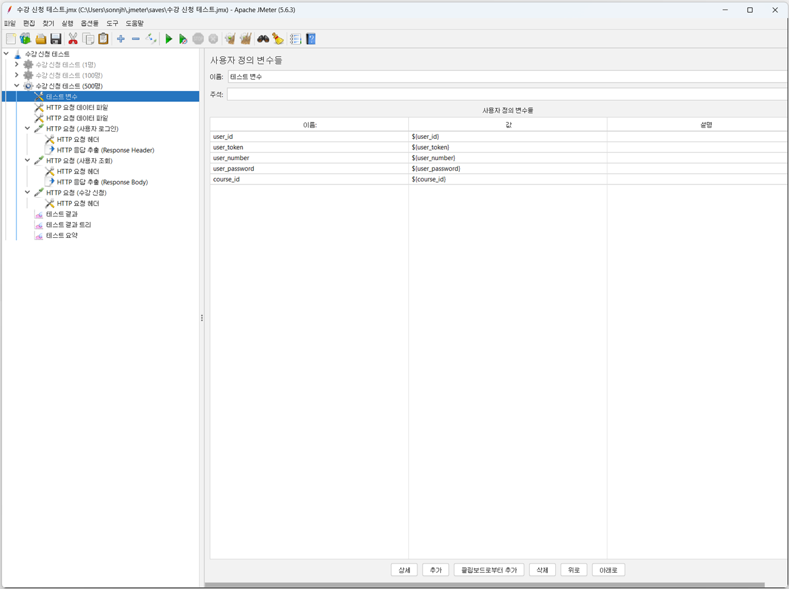
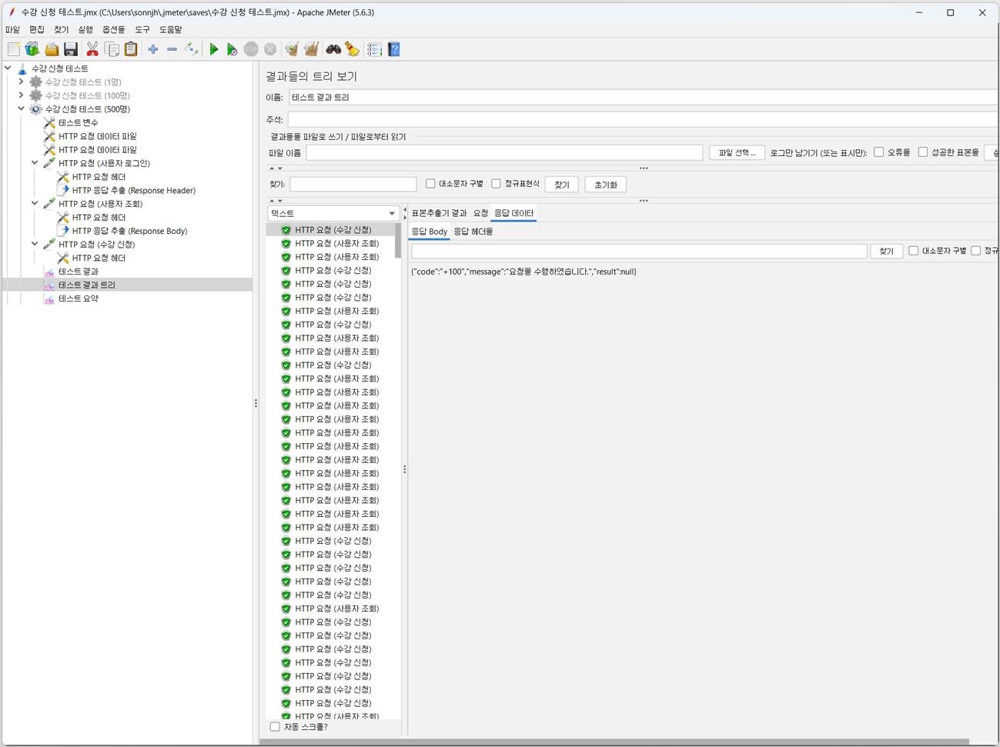
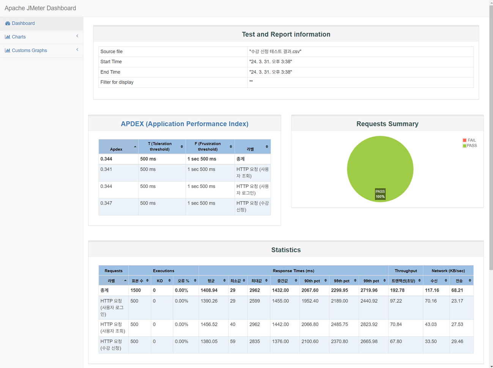

  <h1>수강 신청 웹 시스템</h1>

  
  
  
  
  
   
  
  
  
  

 

  <h2>1. 개발 환경</h2>

- 
<b>OS: </b>Windows (11, 64 Bit)

- 
<b>DB: </b>Maria DB, Redis DB

- 
<b>IDE: </b>IntelliJ

|       라이브러리        | 사용 목적                                                                    |
|:------------------:|--------------------------------------------------------------------------|
|   `opencsv@5.9`   | 학생, 대학, 강의 등 데이터를 작성한 .csv 파일을 읽기 위해 사용하였다. |
| `shedlock@5.10.2` | 2개 이상의 서버 환경에서 Spring 스케줄러의 중복 실행을 방지하기 위해 사용하였다. |

 

  <h2>2. 실행 화면</h2>

 